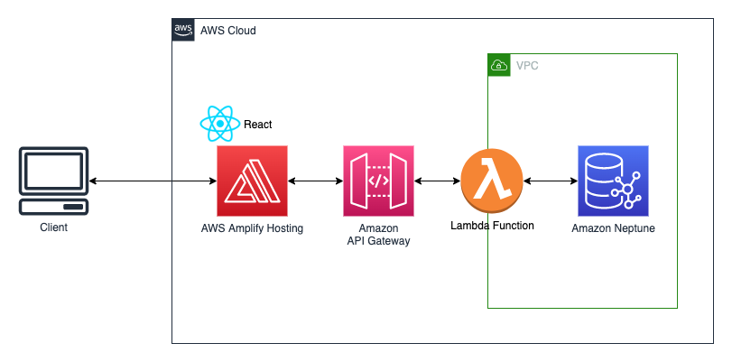
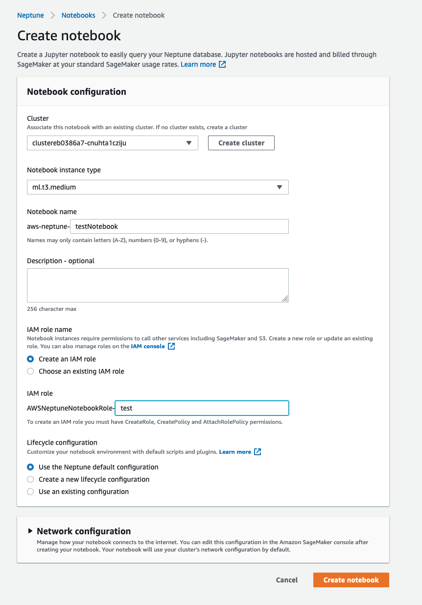
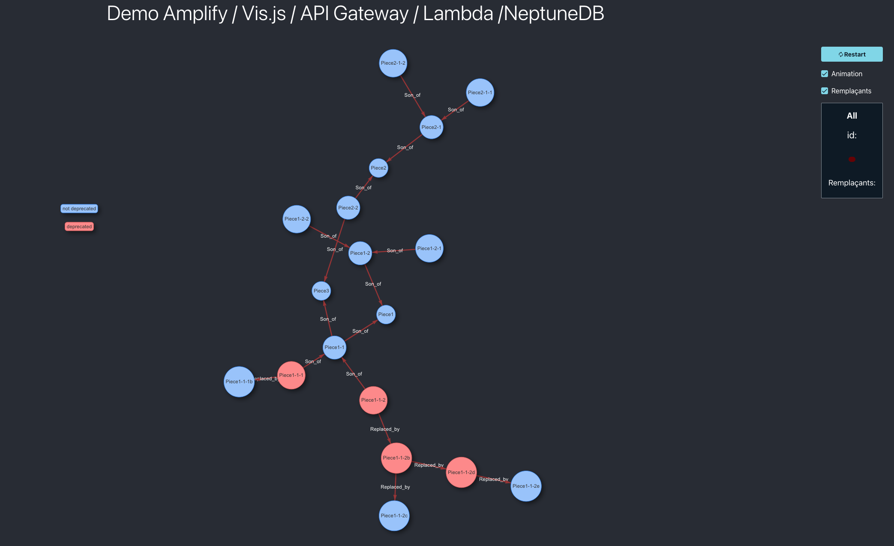

# Visualize your graphDB data in your web browser

This sample demonstrate how to visualize data stored in an Amazon Neptune database with a React JS web application. 

If your application has relationships and connections, using a relational database is hard. But Amazon Neptune, a fully managed graph database, is purpose-built to store and navigate relationships. You can use Neptune to build popular graph applications such as knowledge graphs, identity graphs, and fraud graphs.

## Solution architecture



This solution uses Amplify to host the application, and all access to Neptune is handled by Lambda functions that are invoked by Amazon API Gateway. The front end is created with React, and the backend is powered by Lambda functions built with Node.js. This application uses Apache TinkerPop Gremlin to access the graph data in Neptune, integrated as a lambda layer.

The visualization part is handled using the [vis.js](https://visjs.org) library coupled with the [React graph vis component](https://www.npmjs.com/package/react-vis-network-graph).


## Quick deployment

### **1. Deploy the CDK stack for the backend**

Please run the following commands in your local shell.

``` shell
# Clone the repository 
git clone https://github.com/vikingen13/neptuneDB-Visualization-augmented.git
cd neptuneDB-Visualization-augmented
# Set up and activate virtual environment
python3 -m venv .venv
source .venv/bin/activate 
# Install AWS CDK and neccessary CDK libraries
npm install -g aws-cdk
pip3 install -r requirements.txt   
# If first time running CDK deployment in this account / region, run CDK bootstap
# This is a one-time activity per account/region, e.g. 
# cdk bootstrap aws://123456789/us-east-1
cdk bootstrap aws://<Account Id>/<Region name>
# Deploy the stack. Ensure to replace <E-Mail> with the E-Mail adresss to send notifications to and <AWSREGION> by the region where you want to allow the ressource creation. You will be alerted when ressources are created OUTSIDE <AWSREGION>
cdk deploy
```

In the /neptuneDB-Visualization-augmented/neptunedb-visualization-app/src/backendConfig.json file, replace the value **https://123456.execute-api.region.amazonaws.com/prod** by the output of the cdk stack.

### **2. Load data in the NeptuneDB**  

*Note: It is possible to use Neptune bulk loader option but for the purpose of this demonstration, we decided to show how to use NeptuneDB Jupyter notebook*

Open the AWS console and go to the Neptune service.

Click on notebook and create a notebook.

Fill in the creation form, taking care of choosing the correct neptuneDB cluster.
<div style="width: 50%; height: 50%; margin: auto">


</div>

Open the notebook.

Upload the file neptuneDB-Visualization-augmented/notebook/PDR.ipynb in the notebook and open it.

Run the notebook steps until "Verify the data was inserted"

*Note: You'll find exemples of queries in the notebook. Feel free to try them*

### **3. Build the front end** 

Note: This section assume that Amplify is already installed and configured in your environment.

Please run the following commands in your local shell.

``` shell
# Change directory
cd ../neptunedb-visualization-app

npm install

amplify init

amplify push

amplify publish

```

Open the url returned by the command line. You should access the following website.

<div style="width: 60%; height: 60%; margin: auto">


</div>


## Useful commands

 * `cdk ls`          list all stacks in the app
 * `cdk synth`       emits the synthesized CloudFormation template
 * `cdk deploy`      deploy this stack to your default AWS account/region
 * `cdk diff`        compare deployed stack with current state
 * `cdk docs`        open CDK documentation
